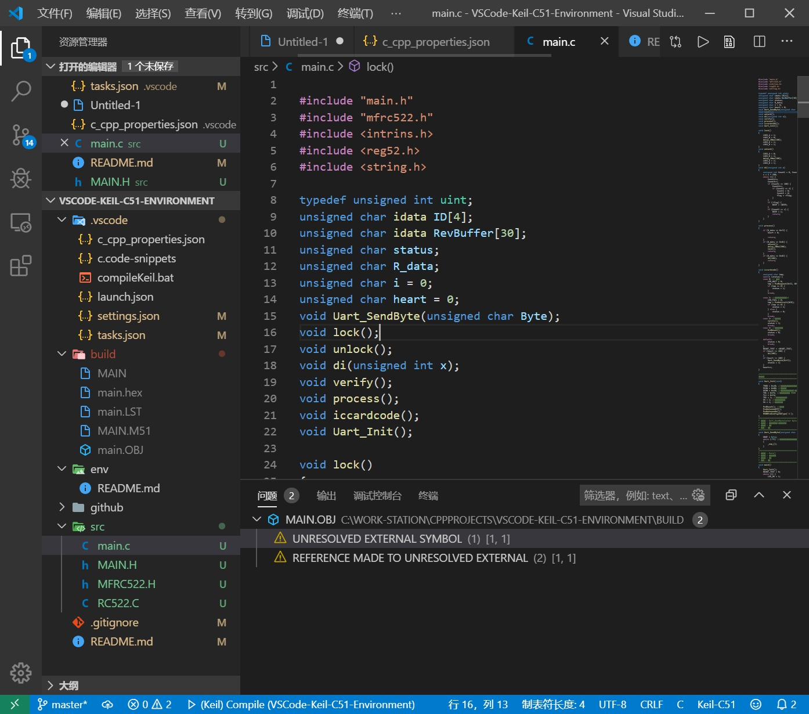
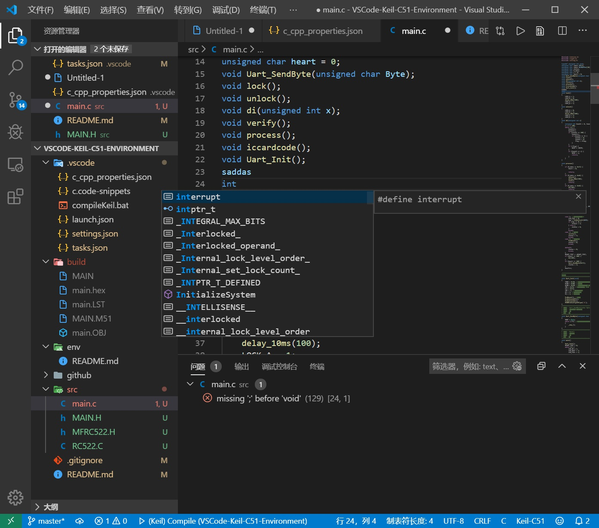

# 使用 VSCode 编写和编译 51 单片机

优雅地编写单片机代码

## 特点

 * 直接调用 Keil 工具链而无需启动 μVision
 * 无需安装额外插件
 * 提供较好的 Keil 编译器错误格式化显示
 * 对常用宏和 Keil 特有语法进行了宏定义，以提供更好的代码提示
 * 抑制了部分智能错误检查以兼容 Keil 特有语法

## 使用方法

1. 下载本项目并解压
2. 用 VSCode 直接打开文件夹
3. 修改 `.vscode/compileKeil.bat` ，替换 `C:\RT\Keil` 为 Keil 安装路径
4. 修改 `.vscode/c_cpp_properties.json` ，替换 `C:/RT/Keil` 为 Keil 安装路径
5. 在 src 目录创建 `main.c`
6. 按 *终端* -- *运行任务* -- *compileKeli* 编译项目

默认入口文件为 `main.c` ，可在 `tasks.json` 修改